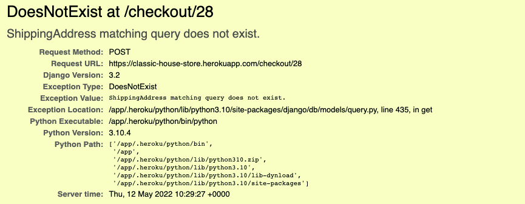

# Classic House Vinyl Store
### Developer: Edward Gurney
INSERT PICS OF SITE HERE
### You can view the live project here: [Classic House Vinyl Store](https://classic-house-store.herokuapp.com/)
 

## **Table of Contents**
[Introduction](https://github.com/edwardgurney/ClassicHouseStore#project-5---introduction)

[User Experience](https://github.com/edwardgurney/ClassicHouseStore#user-experience)

[Site Owner Goals](https://github.com/edwardgurney/ClassicHouseStore#site-owner-goals)

[User Stories](https://github.com/edwardgurney/ClassicHouseStore#user-stories)

[Design](https://github.com/edwardgurney/ClassicHouseStore#design)

[The Site](https://github.com/edwardgurney/ClassicHouseStore#the-site)

[Admin Panel](https://github.com/edwardgurney/ClassicHouseStore#the-admin-panel)

[Features to Implement in future Versions](https://github.com/edwardgurney/ClassicHouseStore#features-to-implement-in-future-versions)

[Testing](https://github.com/edwardgurney/ClassicHouseStore#testing)

[Additional Testing](https://github.com/edwardgurney/ClassicHouseStore#additional-testing) 

[Languages and Technology Used]()

[Frameworks, Libraries and Dependencies]()

[Technology and Validation](https://github.com/edwardgurney/ClassicHouseStore#technology-and-validation)

[Bugs](https://github.com/edwardgurney/ClassicHouseStore#bugs)

[Deployment](https://github.com/edwardgurney/ClassicHouseStore#deployment)

[Credits](https://github.com/edwardgurney/ClassicHouseStore#credits)

[Acknowledgments](https://github.com/edwardgurney/ClassicHouseStore#acknowledgements) 

## **Project 5 - Introduction**
This website is an e-commerce (business to consumer) site for a hard to find record store specialising in vinyl for classic house of various genres. 

The site is for anyone that loves house music, but more specifically for those that collect vinyl or those looking for particular records that aren't as available as they once were. The site will be light touch, in terms of its feel, as the product descriptions will be written by music lovers with a blog/personal feelings about the records (written by the store owner).

User experience has been hightened with the ability to click and listen to a slice of the track/record. This was a particular deign feature I wanted to implement from the start. 

When landing on the site, the user will be greeted with records so that they can start viewing and listening straight away, and can add to cart on the homepage or viewing the product details. They can purchase as a registered user or visitor and stripe payment functionality has been implemented.

CRUD functionality is employed using a database to store relevant data and various models have been created. 

An Agile methodolgy was used during the development process and this has been documented through the use of the projects tab in github reocrding issues and utlisation of kanban boards.
## **User Experience**

### <b>*Project Goals*</b>
Classic House Vinyl Store is a an e-commerce site where users can hunt down hard to find records and for any house lovers to purchase records for their DJ sets or for use at home. It will provide an easy to use site, where users can locate what they want easiliy, using filter and search, but also the ability to use browse the site. 

The site will allow users to register for an account and will incorporate Stripe functionality to allow single payment transaction at checkout.
### <b>*Business Goals*</b>

As a business owner the site needs to be pleasing and easy to use to encourage users to start listening to music quickly. This is to try and increase purchases on the site. Product descriptions with a persoanl touch is also important so that site users and new site users (maybe users that are just finding their way in the scene) can get an experts view on classic records. 

Giving customers the ability to listen to a section of the music, to check it is what they are looking for will also help to increase sales.

Features search as filter and search will allow users to hunt down what they are lookingn for quicker, and also allow them to filter their favourite genre of house music. 

### <b>*Marketing*</b>

In addition to the above, some further marketing strategies will be used to optimise the sites reach. Search Engine Optimization (SEO) has been considered throughtout development in an attempt to improve the search engine ranking of the site. To do this I perfromed an exercise where I identifed what I thought would be the keywords that people would use when searching for a site. I used these words in the development when coding, and added some in the keywords meta tag in the base template. 

There is also a site map that can be accessed from the homepage, and this is a way to improve a sites search engine ranking and allows search engine bot crawling.

### <b>*E-Mail Marketing*</b>
When users sign up they need to provide an e-mail address and when they do they will receive a 'welcome e-mail' thanking them for signing up. The e-mail will be stored for future marketing campaigns, and also is used to send a confirmation e-mail when they place an order with their order details and order number. 
Currently, the e-maisl come from a personal account of mine that was used in testing. In the real workd this would be an e-mail set up from the store, rather then a personal account.

### <b>*Social Media*</b>
As part of the project and to maximise reach to the store owners audience, social media sites such as Facebook would be employed. This would allow the site owner to interact with customer directly and would over time, build up more content for customers to browse through. Below is a wireframe of what the page would look like. There would also be further pages set up on other social media sites, such as Instagram, Twitter and Tik Tok.

### *Site Owner Goals* 

### *First Time User Goals* 
- I want to be able to find certain records quickly via search and filter.
- I want to be able to find my way around the store easily, without there being a learning curve. It needs to be easy to use. 
- I want to be able to browse through the store easily, where I can just listen to music for when I'm not looking for anything in particular. 
- I want to be able to register on the site and be able to log in.
- I want to see the prices of records so that I know how much I am spending.
-If I sign up as a first time user I Want to receive a confirmation e-mail so that I know everytning has completed properly. 

### *Returning User Goals*
- I want records to be easily finadable, so that I can listen to the music again, or find them if I am returning to the site to purchaase.
- I want my basket/bag to keep what I have added to basket, so that if I don't purchase the first time, I can return to the site later and purchase. 
- As a registered user when logged in, I want to be able to rate records so that I can shre my views with other site users. 

### *Purchasing User Goals*
- When purchasing records, I would like to be able to increase or decrease the amount in my basket.
- I want to be able to save my address details so that I don't have to type them in every time I visit the site and purchase something. 
- I want to be able to enter my card details quickly and easily.
- I want to receive and order confirmation e-mail. 

### *User Stories*
Below is an image of the original user stories that was performed at project initiation, these were what needed to be implemented for the project to be a success. In total there are 20 user stories. The second image below is the Agile tool used in Github during development, this was used to map the user stories to the project goals. During development there was an additional user story implemented, taking the toal to 21.

An image of the user stories during the project planning stage

This second image shows the Agile tool and the Kanban boards used during development

 

You can access the Kanban boards in the githib repository
[here](https://github.com/edwardgurney/ClassicHouseStore/projects).

## **Design**

### *Balsamiq Wireframe*
During the project planning stage, some wireframes were constructed for the homepage, product detail page and site map, and additionally the homepage for a mobile and smaller screens.
 
 

### *Homepage - Larger Screens*

 
 

### *Product Details - Larger Screens*

 
 

### *Site Map - Larger Screens*

 
 

### *Homepage - Mobile Screens*

 
 

### *Images*

Where possible, all images are actual photos of the item in stock. This is becasue records will be in various conditions once they have been sourced and this will provide an idea to the user of the quality. Currently, all iamges are acutal records in stock, but this may not be possible going forward to provide for all recrods. 

### *Font Awesome*

Font Awesome was used for some icons using the i tags. Such as the listen button.  

## **Database Schema**

During the planning stage, entity relationship diagrams were created to plan the models that would be required during development. In total, there were 5 models designed at this stage. These were User, Shipping, Product, Bag and Order models. 

These can be viewed below:

As development proceeded, more models were required and this was a learning curve for me in the amount that could actually be required in an e-commerce site.

## **The Site**
This next section will breakdown the site pages from the front end.
### **Homepage**

The template used for the app was a Bootstrap template which can be found [here](https://getbootstrap.com/docs/5.1/examples/album/) and I used various other components to structure the page as close to the initial designs as I could. For example, the navbar is not part of the same template used for the basic homepage structure. 

### **Navbar**

The navbar was a template taken from Bootstrap and can be found [here](https://getbootstrap.com/docs/5.1/examples/navbars/). I amended this for the purposes of the site. The store name will take the user back to the homepage if clicked. This is purely for user experience as users are used to this from other sites. The 'Home' tab also does the same thing.

Users can aso view their basked, if they are logged in this will save their basket from a previous session so that they can return to it later. 

 

### **Filter**

Importantly for user experience the next tab 'Genres' is where users can filter specifically the type of house music that they are looking for. This will increase UX in that they won't be greeted ith house music that isn't to their liking. 

The navbar also provides 'login', 'logout' and 'signup' tabs. Depending on the status of the user, different tabs will be visibile. For example, if they are signed in, only logout will be visible. If they are logged out, then login and signup will be visible. Below you can see the navbar when a user is not signed in.

 

### **Login Page**

 

### **Sign Up Page**

 

### **Search**

Finally on the navbar is the 'search' field. This is important for UX, and anything that the user is looking for can be found. The user will need to know the name of the artist or the track name. If there is more than one track from the artist on the site, the user will see all tracks from that artist. 

### **Products**

All products have their own product tab on the homepage for quick and easy viewing. A goal of the site was for users to have quick access, so they can start looking at and listening to records staright away. On the product tabs some quick information is provided, such as title, artist and price. Users can also quickly add to basket, click 'view' to review more details and also listen to the track via Spotify. 

### **Product Details**
 

The product detail page extends the base template and keeps the navbar and footer in place. The information added to the admin panel is rendered to the page, showing product details such as artist, label, price, genre and description. The description is written by the store owner. 

 

### **User Interaction**

Beneath the product details are some further user ineteration features. The user can click 'listen' to be taken to Spotify to listen to the track, users can also go back to store and most importantly 'Add to Basket'. This is pre-populated to 1, but when the user hovers in the box, they can adjust the amount by clicking the up and down arrows that appear. 

Finally, the user, if they are logged in, can rate the record out of 5. The average rating of the record from all users is also shown, so that users can see how popular a record is. All of the functionality that requires the user to login (such as this one) uses login required decorators in the views.py file. 

### **Basket**

The add to basket page is as what one would expect. It shows an item number for each product added as well as the record title and the total amount payable. Here, the user can also increase or decrease the quantity and if they want to remove the item they can do so by changing the quantityt to zero. 
The navbar and footers appear as they do on all pages, and this is the page where the user can review their purchase before proceeding to the checkout page. They do this by clicking the checkout button. 

 

### **Checkout**

The checkout pages took a lot of work and was one of the most challenging parts. Users can enter their shipping address, with the additional option of providing a telephone number. They can save the address, so that when they return to site, they can select the address that they would like their items sent to. 

 

### **Cart**
Users can also view their cart in the top right hand corner of the page. This will show the items they are buying and the prices they will pay as well as the total amount of items in their cart. 

 

### **Payment**

Users can finally, once they are happy with their order and their shipping address information, click on the 'Make Payment' button.

 

Users are then greeted with the payment page where they can input their card details. Stripe was integrated into the site using the Stripe JS package. This part of the project was one of the harder parts to get functional, not helped by the security issues that Heroku were experiencing at the time, and not being able to test through gitpod. 

### **Thankyou Page and Confirmation E-mail**

**ADD IMAGE OF THANKYOU PAGE**

Once the user has entered their card details and clicked 'Pay Now' they are taken to a thankyou page where they are provided with an order number and a thankyou message. Users can click a button to continue shopping, which will take them back to the homepage. They are also sent a confirmation e-mail for their records, that has the order number and a thankyou message. you can see examples of this below.

## **The Admin Panel**

The admin panel is the beating heart of the site and is the back office for the store and CRUD functionality. Admins (superusers) can create new stock items, and create, edit/update all the main information required for the site, such as genre, price, description and label. Additional genres can also be added if it is not facillitated in the current option and genres can also be deleted if they are no longer required. 

Within the admin panel users accout details can be accessed, such as their shipping addresses and contact telephone numbers. Admin users can also see what users have rated what records and check users bags, open orders and details of order numbers. These can be amended within the admin panel if needed. Below are some screen shots of what I have discussed above. 

The above shows the models that are available in the admin panel and are in the models.py file, they are then added to the admin panel in the admin.py panel. 

 

The below image shows headline information of user accounts accessed when admin users click the 'Users' tab in the side panel, each of these can be clicked on to obtain ore detailed information of the users. 

 

The below is a representaion of the product model as it is seen in the admin panel. You can see each product from the site has been added here, with the relevant information added from the fields in the prodict model, for example, artist and price. New items can be created and added at this point. 

 
When admin users click on the item, they are then taken to the finer detail (see below), where they can amend any information to the provided fields that they like. This is also where they can add links to Spotify so that the user can listen to the record. There is also an option to add a media file. This is so the store user can add their own 1 minute clip of some audio in the future. 

 

The product model section also has a useful filter implemented, that provides the facility for admin users to search for a particular product via a number of ways. For example via artist name, label, or track name. This, will become incredibly useful to the store owner once there are thousands of records on the site and will allow them to quickly find the record that they are after to be able to update, amend or remove what they need to. You can see an image of this filter below.

The below image is the cateory model that is acceeible on the admin panel. Here new categories can be added as and when needed. 

### **Features to Implement in future Versions**
There are many features that I would like to implement in future versions if I had more time. 

1. Firstly and most obviosuly, I would like to improve the UX and the presentation of the site. This site is very much a proof of concept, that the site works as it should and purchases can be made. There is some basic cosmetic design, but the first thing to change would be to improve this. This should be just a time thing, because the mechanics of the site are now working as they should. This is of particular importance to the site map page, and the thankyou for your oder pages, as they are very standard at the moment. I included them for project requirements and it can be seen that they are functional, time constraints did not allow me to get these to how I wanted them to be. 

2. More stock would be added to the site over time, with pagination to keep the home page neat and tidy.

3. I would like to implement the ability for admin users to select an item as out of stock, so that this takes the item off of the site (or notifies users that it is out of stock). Currently, admin users will have to notice when an item is out of stock and remove it manually. This could lead to dissapointed customers that order something that isn't in stock. 

4. Developing on this further, I would love to implement a system that can do this automatically, so admin users can add the amount they have in stock once, and then when a reord is purchased, it automatically reduces the amount in stock.

5. Something noticably missing for me in this is account information for users. I would like them to be able to access their account information, and change and update their details as and when. I'd also like them to be able to view their past orders.

6. I would also like to add to the site 1 minute snippits of the music. This facility is already there in terms of the admin panel, becasue as you will see, I included it in my original products model (as it fomred part of my planning really early on in the design stage). However, logisitcally for this submission, obtaining the relevant 1 minute clips, recording them and then adding them to the product in the admin panel was time consuming, and I needed and wanted to get the submission done. However, this facility to do that is pretty much there already I think, so could be implemented rather easily in a future version. 

## **Testing**
### **Manual Testing**

During the project Agile methodology was employed to encourage efficient project development. Kanban boards were used as part of this process and each issuse was fully tested before moving to 'complete'. The Kanban boards were essentially the user stories designed at the start of the project. All of the user stories have been tested and these have been evidenced below in the images provided. This is to try and show thorough manual testing has been performed and whilst some of this has been documented in the site breakdown section, I wanted to link them directly to the user stories in this section. 

### **User Story 1**
* As a shopper I can view a list of records/vinyl so that I can purchase what I want.

The above screenshot, which you have already seen during the breakdown of the sites pages, meets this user story as it shows a visual list of the records that are available. 

### **User Story 2**
* As a shopper I can view individual product details so that I can find out more about the product, such as the label it is released on, price, year of release.

The above image shows an example of the product details page, meeting the requirements of the user story above. 

### **User Story 3**
* As a shopper I can view a description of the record so that find out more about the record

The above picture shows the product description that a shopper can read to find out more about the record. It also includes a link to wikipedia for them to find out even more. Thus completing User Story 3.

### **User Story 4**
* As a shopper I can easily view the total of my purchase/s so that understand how much I'm spending as I add to cart.

The above two images show a couple of the different times during the process that the user can view how much they are spending. 

### **User Story 5**

* As a site user I can register for an account so that I can save my details

The above image shows that registered users address details are saved for quicker checkout.

### **User Story 6**
* As a site user I can log in and out so that I can view my account info such as open baskets from previous adds.

This is similar to the previous user story, that the user can view their saved address details to select from what they have previously inputted. Additionally, if the user has an open basket that hasn't been purchased, it will still be there for when they return. You can see this in the image, where in the admin panel the 25th order done during testing is still open, so when the user logs back in, these items will still be in the basket.

### **User Story 7**

* As a site user I can receive an e-mail confirmation once registered so that I can refer to it in the future

The above is the baasic e-mail response received ince the user signs up, they receive an e-mail confirming that it has happened and that it has been a success. This shows that the functionality is complete for this user story, and the e-mail will be beefed out by the store owner. 

### **User Story 8**
* As a site user I can select if I think the record is 'banging' so that I can see how popular it is.

Shoppers can see the average rating of a product to see how popular it is. The above image shows this one is very popular at a rating of 5.

### **User Story 9**
* As a shopper I can search for a record by name, artist or label so that I can filter records I want to purchase

Any item in the store can be found by using the search bar. 

### **User Story 10**
* As a shopper I can sort specific genres of house music so that I can find more of the genre I like.

Any genre can be filtered, allowing users to find their preferred style of house music quicker. 

### **User Story 11**

* As a shopper I can by some means, listen to the song or a clip from it so that I can check that I am purchasing the correct physical record.

Users can click the listen button to check they are happy with the song. 

### **User Story 12**
* As a shopper I can select the quantity of a product when adding to cart so that I can order more than one if I want to.

As you can see, users can increase or decrease the amount of records of the same name they want in their basket. 

### **User Story 13**
* As a shopper I can view my bag before purchasing so that check what I have ordered and check final cost.

Users can view their total in the Order Summary page, which is the checkout url.

### **User Story 14**
* As a shopper I can change the quantity in my bag so that I can amend if I change my mind or am spending too much.

Again, similar to a previous user story, this one is achieved on the basket page before the user clicks checkout so that they can make any final decisions based on their bag total. 

### **User Story 15**
*As a shopper I can enter payment information so that I can checkout quickly

Implementing Stripe into the site allows users to enter payment information quickly. 

### **User Story 16**
* As a shopper I can order safe in the knowledge that my personal and payment info is safe so that feel confident in providing that info.

The confirmation email that users receive once completing their order should provide the comfort required that the order has been made to a reputable company. 

### **User Story 17**
*As a shopper I can view and order confirmation so that I can be sure the order has been a success.

Once the order is placed, the user is sent to an order confirmation page.

### **User Story 18**
* As a shopper I can receive an email confirmation so that I have a copy for my records

The above image it is taken from an automated e-mail received once an order is placed and thus completing this user story. 

### **User Story 19**
* As an admin I can add a product so that I can add items as they become available

The above image is taken from the admin panels 'products' page. This will allow site admin to add new products and fill out the required data to populate the information. 

### **User Story 20**

* As an admin I can edit/update a product so that I can change anything about the product I want to, such as price

The above image shows that data can be edited and updated. 

### **User Story 21**

*As an admin I can delete a product so that I can remove items that are currently out of stock

In the above image you can see how as an admin they can delete a product if the item goes out of stock. 

 
 

### **Additional Testing**
* The site has been used by friends and family to try and find any errors. There are no known errors in this version that have been found that haven't been fixed during the development process. 
* Throughout the process the developer has navigated through the site on a continual basis and no issues are currently noted. They have been fixed as the development has progressed and the majority of these I have documented in the bugs section of this file. 
* Google Chrome Developer tools has been used throughout to identify styling issues that impact upon display and UX. Dveloper tools was used to find the errors and amend.
* All links were tested multiple times during the development process and after deployment

### **Compatability Testing**
* The site has been tested on all mainstream browsers, Chrome, Firefox, Safari and Edge and no issues seem to be present. 
* The site has been tested on multiple screen sizes, not only in developer tools but also on physical handsets, includeing the iPhone 10, XR, 12SE and the GalaxyS22 and A52S. No problems were noted, and this is largely down to Bootstrap making the process a lot less painful.

## **Languages & Technology Used**

### **Languages**
#### **Python**
#### **JavaScript**
#### **HTML5**
#### **CSS**

### **Frameworks, Libraries and Dependencies**

#### **Django**
 * Django Summernote - Used to provide admins with an easier way to provide content for the main site, in the back end. This allows admins to improve the layout. 
 * Django all-auth
 * Django Crispy forms
 * Django Messages
 * Pillow - 
 * Gunicorn 
 * Cloudinary - Used to store images externally to assist with Heroku issues of wiping content. 
 * Postgres - Databse management system used. 
 * Bootstrap
 * Font Awesome

### **Technology and Validation**

 
#### **Stripe**
[Stripe](https://stripe.com/gb) was used for all payment activity on the site. An account was created and the API used to allow communication between Stripe servers and customers payment details once submitted to be processed. 

Above is an image of successful payments going through on the site. This is accessed on the payments tab of the dashboard.

 

#### **PEP8 Validation**

[PEP8](http://pep8online.com/) was used to check for any errors. All of the code passes with no errors or warning present due to bad code. Example screen shots of some of the code are below:

This screen shows the top of the file and the code being accepted on Pep8 for Python code. All python code was tested using this process. I removed all genuine errors and there were a few 'line too long' warnings. Originally I left some of these in becasue they were long variable names rather than bad code. I was also of the opinion that, whilst I am aware of the 'line too long' item, it applied to a time when monitors were smaller and a max line limit of 80 was the accepted convention. Nowadays with bigger screens this is no longer the case, and longer lines are still readable/accepted. However, after discussion with my mentor I decided to break these lines down so that they fit with convention, even if I don't think it is aboslutely necessary all of the time.

 

#### **WC3 Validation**

The [WC3](https://validator.w3.org/nu/) validator was used to check for any errors in the HTML code. All code passes with all major errors removed. 
#### **CSS Validation**

#### **JS Hint Validation**

## **Bugs**

### Fixed Bugs

There were many bugs throughout the development process that were discovered and fixed. I have provided details on some of them below. Currently I don't believe that there are any bugs in this current version. 

* If users proceeded to checkout, after amending the quantity in their basket to 0, would still let them proceed to payment. Whilst the site warns users that their bag is empty, clicking on the 'checkout' button would allow them to proceed to payment and if the user entered address details and clicked 'pay now' froze the screen and would not let them proceed. 

* Similarly, if the user clicked 'make payment' without selecting an address I got an DoesNotExist error. I managed to remember to take a screen grab of this to provide as an example. 

* Significant CSS problems during devlopment meant that no styling was working as it should. To prevent this from happening I inputted CSS in style tages during development, with the intention of fixing later. You may have noticed this in some of the screen shots I have provided, that some of the CSS isn't working. 

* When updating items in basket and selecting update it was resetting to the previously selected quantity. In the terminal, using print() it was sending that quantity but for some reason wasn’t showing this on the site. 

* Console error was indicating that it could not handle submit. I discovered that there was a conflict between two forms, one was inside another so the submit button could not tell which one it was submitting because they were nested. 

* Terminal was returning an error of 'Invalid Integer 18.99. 

* When I tried to ad to the model, gitpod rejected it saying “You are trying to add a non-nullable field 'product_ID' to product without a default; we can't do that (the database needs something to populate existing rows).
Please select a fix:
 1) Provide a one-off default now (will be set on all existing rows with a null value for this column)
 2) Quit, and let me add a default in models.py”

I googled the issue and found this on stack overflow to fix it: 
https://stackoverflow.com/questions/32991965/you-are-trying-to-add-a-non-nullable-field-id-to-contact-info-without-a-defaul

Despite the above, the product_id was not showing up in the admin panel, even after re-pushing. The above fix advised to have editable set to False, but changing this to = True made the field appear in the admin panel. 

* Images were not rendering on storefront, despite them being uploaded in the correct way via the admin panel and seemingly cloudinary being installed correctly. 

* Font awesome was not rendering requested fonts despite using same process used many times before. 

* E-mails weren't being received for the sign up process, this was because the tempalte was not being rendered and I found the solution on stack overflow to use .render() to render the template:
https://stackoverflow.com/questions/18055029/python-django-emailmultialternatives-template-object-has-no-attribute-encod

* Gitpod wasn’t allowing ports to open which was causing problems with allowing API’s to work. This meant I could not check (for security reasons) to see if e-mail and payment Stripe was working. 
Ports were open on Heroku so I was using Heroku to check this. I used Django messages to display errors because the terminal was accessible. I was testing on the actual site and unable to in development because Gitpod is what I was using for development. This meant a longer process to push every time I wanted to test, but I wasn’t sure what else to do. 
This has made apparent to me that VS Code on my laptop will be my future development ‘go to’, rather than online using Gitpod. This will allow me to test more conveniently. I’m not sure for the future if this means you will be able to test API’s on gitpod or not, but for the duration of this project I had to do it through the actual site and deploy to Heroku constantly. 

### Bug/Issue

### Unfixed Bugs and issues

## **Deployment**
### Forking the repository 
To create a fork:
 * Log in to Github and click on the [Classic House Store Repo](https://github.com/edwardgurney/ClassicHouseStore).
 * Click on the 'Fork" button located in the top right of the screen.
 * This should now provide you with a fork in your Github account. 

### Cloning the Repository 
To create a clone:
* Log in to Github and click on the [Classic House Store Repo](https://github.com/edwardgurney/ClassicHouseStore).
* Click on the dropdown button called 'Code'. Once clicked you will see a URL for the site, copy this URL by clicking on the clipboard.
* Click on the Gitpod button
* Navigate to the bash terminal, enter 'git clone' and then paste the copied URL and press enter.
* You should now have cloned all files in a workspace. 

You will need to install all of the dependencies from the requirements.txt file into your workspace for it to work. 

#### Local Deployment

### Database
1. Add DATABASE_URL to settings.py:
    DATABASES = {
    'default': dj_database_url.parse(os.environ.get('your database url'))}
2. Migrate database (after perfroming --dry-run)
3. Create superuser to navigate database

 
## **Credits**

I viewed a number of sites and video tutorials. I have listed these below.

* The video series by [Dennis Ivy](https://www.youtube.com/watch?v=obZMr9URmVI) on an e-commerce site was very helpful and helped clarify general areas, for example project set up and Django.

* I used this video series by [Very Accadmey](https://www.youtube.com/watch?v=UqSJCVePEWU) to be absolutely fantastic at explaining the concepts required throughout the process. 

* This video by [Free Code Camp](https://www.youtube.com/watch?v=YZvRrldjf1Y&t=4320s) also helped with general ideas and clarity on the process of an e-commerce site. 

* All of the images used were photographs of items the site developer has purchased and owns. These were used as examples and not for commercial purposes. 

* As mentioned [bootsrap](https://getbootstrap.com/) was used for the main structure of the site, using templates and componenents and chagning them to suit the site layout. 

* [MyColor](https://mycolor.space/) was used to get an idea of colors that would complement each other. This was a rather basic look, considering the site is only a couple of colors, but it was still a worthwhile exercise.

## **Project Reflection**
Overall this has been incredibly tough compared to the other projects but I am relatively happy with how it has gone. There are a lot of improvements that I would like to make to it, but time constraints and other commitments for a project of this size have proven dificult for me to implement what I would like. I am happy with the code and that the foundations of a good working site are in place. It has been a long 14 months on the course, with little respite, and so I am just happy to get this project away and have a couple of months to rest and reflect, and then pick up some fun projects. Creative design may not be my strong point, and I believe this is evident in this submission, but I have learned that this is an area to improve upon and to really assess similar sites in the future to get some ideas, I also believe (and hope) that in the real world, working in dev teams, that there will be assistance and specialists on hand for these areas. The learning experience of creating a full e-commerce site has been massive, and whilst I knew this project was large, I'm glad I didn't know how much work was needed at the start, as it may have been overwhelming for me. 

I would have loved to have completed this course as a full time student, like a lot of my colleagues are able to. Working full time and being a father to two children under 3 has meant that the amount of time that I have been abe to spend on it is significantly lower, yet I am still proud of what I have been able to do. When I look at the presentation of other submissions, it can be disheartening becasue I know that if I was able to put 40 hours a week into the course, and still get my weekends off (or just have no children to look after) I would have been able to maintain some more merit grades to add to the ones I have got, and maybe even a distinction or two. My mentor Chris Quin, who has been amazing to me, has made me see that the race is just against myself and nobody else. However, I work in the week and then my weekends are taken for the course, which has led to very little time off over the last year, which has been a struggle and my mental health has suffered and my marraige has been under additional strain, my wife has been amazing to support me though this. Adding onto this my father having a heart attack and my 3 month old son being admitted to hospital just in the last few weeks has added to the strain. I think that CI should not be advertising this course as 12-15 hours per week, becasue for people with no coding background, it is certainly not. It is 20-25 hours just to keep up, and when you are working 40+ hours a week in full-time work, this is very very hard to do. 

Despite all of this, the past 12-14 months I have been on a journey, and I have surprised myself of what I have been able to do, I never thought I would be able to do it. Not only with the coding, but I have learnt how to approach things differently in life and feel I have obtained a new life skill. I will continue to practice my coding, after a well earned break, and whether I pursue a career in it or not, I'm happy that I will at least be able to help my two children when they start to do this at school. If I hadn't have done this course, I'd have had absolutely no idea how to help them.

## **Acknowledgements**
My amazing wife who has managed our two children on her own a lot over this past year (and also been pregnant with one of them). Time I won't get back with them, but I am greatful for her and hopefully now I can get back to helping her and being a good father to my two amazing children.

My mentor Chris Quin, really helped pick me up at times, having my mentor sessions out of motel rooms when I am away with work, it got on top of me at times but he has a way of making you feel that you can do it. I will always remember him as a really great guy. 
